# BOHO Living!

 

[View live website here!](https://msp4.herokuapp.com/)

[View GitHub repository here!](https://github.com/jennymalmoe/MSP4)

 

 

BOHO Living (referred to "B.L" onwards in this README) is an online home decor shop that offers a selection of trendy home decor and fashion items inspired by the modern bohemian style.

This is an e-commerce web application for a fictional company, created for the purposes of satisfying the requirements for the Code Institute Full Stack Development Course Milestone Project 4. The application features e-commerce functionality, payments using stripe, a blog section for admin as well as users to add blog posts, confirmation emails, CRUD functionality for admin to add stock items, and an admin section, for the admin user to access database records.

This website is only for educational purposes and the stripe functionality is set up to only accept the test card details below, please don't enter your personal card details.

When using the Payment Intents API with Stripe’s client libraries and SDKs, use the following test card number and details:

**Card Number: 4242 4242 4242 4242**

**Month/Year : 04 / 24**

**CVC: 242**

**ZIP: 42424**

An account with Super User privileges has been created for testing purposes. The username and password will be supplied when submitting the project.

 

## Table of contents

___

* [UX](#ux) 
  * [Project Goals](#project-goals)
  * [Business Goals](#business-goals)
  * [User Stories](#user-stories)
  * [Design Choices](#design-choices)
    + [Color scheme](#color-scheme)
    + [Typography](#typography)
    + [Imagery](#imagery)
    + [Icons](#icons)

  * [Wireframes](#wireframes)

 

- [Features](features)
  * [Existing Features](#existing-features)
  * [Features Left to Implement](#features-left-to-implement)

 

- [Database Design](#database-design)

 

- [Technologies Used](#technologies-used)
  * [Languages](#languages)
  * [Frameworks, Libraries & Programs](#frameworks,libraries-programs)

   

- [Testing](#testing)
  * [Testing User Stories from User Experience (UX) Section](#testing-user-stories-from-user-experience-(UX)-section)
  * [Further Testing](#further-teseting**)
  * [Known Bugs](#known-bugs**)

 

- [Deployment](#deployment)
  * [GitHub Pages](#github-pages)
  * [Forking the GitHub Repository](#forking-the-github-repository)
  * [Making a Local Clone](#making-a-local-clone)

 

- [Credits](#credits)
  * [Code](#code)
  * [Content](#content)
  * [Media](#media)
  * [Acknowledgements](#acknowledgements)

 

## UX

## Project Goals

 

The purpose of this project is to 

*"...build a full-stack site based around business logic used to control a centrally-owned dataset. You will set up an authentication mechanism and provide paid access to the site's data and/or other activities based on the dataset, such as the purchase of a product/service"* using HTML, CSS, JavaScript, Python+Django, a relational database (recommending MySQL or Postgres), Stripe payments
and possible additional libraries and API's. 

**Value provided:**
1. By authenticating on the site and paying for some of its services, users can advance their own goals. Before authenticating, the site makes it clear how those goals would be furthered by the site.
2. The site owner is able to make money by providing this set of services to the users. There is no way for a regular user to bypass the site's mechanisms and derive all of the value available to paid users without paying.

This project has a full set of CRUD (creation, reading, updating and deletion of data records) features. CRUD at user interface level:

|Operation|SQL|HTTP|DDS|Description|
|---|----|----|----|----|
|**Create**|INSERT|PUT/POST|Write|Create a resource: Users can create profiles by signing up. Users can create orders by adding items to bag annd then follow the checkout procedure. Users can create a blog post in BOHO Blog page. Admin can create products and blog posts.
|**Read**|SELECT|GET|Read|Retrieve a resource: Users can retrieve, search and view products.
|**Update**|UPDATE|PUT/PATCH/POST|Write|Update a resource: Users can update/edit the delivery information. Admin can update/edit products and blog posts.
|**Delete**|DELETE|DELETE|Dispose|Delete a resource: Admin can delete products, registered users and blog posts.

 

## Business Goals

 

This e-commerce website focus on maximizing direct sales to new and returning customers (convert a website visitor into a customer) by simplify and optimize content to be easy to shop by a user friendly and well designed online shop that enables secure purchases and inspires. Also establishing brand recognition in the industry. Mission statement: *"To offer quality, popular and affordable boho inspired hoeme decor and fashion".* 

### Target audience

The target audience for B.L is potential customers liking the bohemian style in home decor and fashion. Since this is e-commerce the conversions is the most important part, rather than traffic it self. Conversions take place when targeted traffic meets relevant offer. So it's important that B.L clearly defined what they offers. To avoid irrelevant traffic B.L makes it clear already in its name that thos is boho inspired e-commerce. By basic SEO and a distinct website (mainly the anding page) B.L defines that they offer boho inspired homedecor and fashion. E-commerce sales increaces worldwide, and develop the need to determine target audience, particularly ecommerce stores. B.L ideal customer is a person that likes/has a boho inpired lifestyle, more than demographic data. Online, the location matters less due to home delivery. Age is not what it used to be, the age isn't the defining thing if somebody turns out to be a paying customer. Conversions take place when targeted traffic meets relevant offer, thats why B.L has a really well defined business name, website and offer. 

After created this customer profile, B.L can make use of demographical information, such as name, address, user behavior etc. B.L get the customers details when filling out the order form, where they also can get access to the newsletter. 

In addition to the goals above; 

 

## User Stories

 

This user story template consists of three sections; As a (decription of user), I want (functionality/goal), So that (benefit). It has short descriptions, requirements (who and why), general guidance, no technical details. 

| ID  | As a..    | I want to..                                                    | So I..                                                                           |
| --- | ---------- | ----------------------------------------------------------------- | ------------------------------------------------------------------------------------- |
|     |            | *Viewing and Navigation*                                      |                                                                                       |
| 1   | First Time Visitor    | Be presented with an intutive site navigation that is user friendly and over all ease-of-use                              |  Get a good impression about the site/business
| 2   | First Time Visitor    |    Visit a structured, clean and modern website                      | Understand the main purpose of the site/business and find key information
| 3   | First Time Visitor    |    Get the impression af a professional website                      | Feel comfortable enough to make a purchase
| 4   | First Time Visitor    |    Get visually impressed by the site                       | Find the site appealing
| 5   | First Time Visitor    | View structured lists of products                                             | Can see what the website has to offer and make a purchase in just a few clicks                                                          |
| 6   | First Time Visitor    | View details of the products                                           | Easily can see price, description, image, sizes if any                                          |                                             |    
| 7   | First Time Visitor    | Find items close to what I was searching online                              |  Can find the items I was looking for 
| 8   | First Time Visitor    | Be presented to contact information and social media links                              |  Feeling a sence of crediblity
| 9   | First Time Visitor    | Be able to reach out to siteowner                              |  Get answers to any possible questions
| 10   | Returning  Visitor    | Be presented with new/seasonal items                               |  Experience that B.I is up to date and offer me new items than last visiting
|     |            | *Registration*                              |                                                                                       |
| 11  | User   | Register for an account                                         | Can access to Boho Living                                          |
| 12  | User   | Be able to have an account                                           | Save default delivery information and keep a record of order history, get mails with news and offers                                          |
| 13  | User   | Receive an email confirming my registration                       | Verify my account was registered successfully                                         |
|     |            | *Login*                                  |                                                                                       |
| 14  | Registered User   | Sign in to my account                                                 | Access my account                                                                   |
| 15  | Registered User   | Access my user profile                                            | View my order history, manage my personal details                                     |
| 16  | Registered User   | Save my personal details (address etc) in my account                                            | Can make a smooth purchase next time.                                     |
| 17  | Registered User   | Request a password reset                                          | Receive an email to reset my password in case I forget it  
|     |            | *Logout*                                  |                                                                                       |
| 18  | Registered User   | Sign out of my account                                                 | Secure that nobody else makes a purchase from my account.                                           | 
|     |            | *Sorting and Searching*                                       |                                                                                       |
| 19  | Shopper    | Sort the list of available products                               | See the products in a list sorted by price, rating, name etc            |
| 20  | Shopper    | Be able to search by categories                                       | Find what I am looking for                     |
| 21  | Shopper    | Sort multiple categories simultaneously                           | Find the best rated or best priced across broad categories |
| 22  | Shopper    | Search for product                                                | Find a specific product I wish to purchase                                               |
| 23  | Shopper    | View a list of search results                                     | See if the product I want is available to purchase  
| 24  | Shopper    | View an image and details for each product                                     | So I can decide if I want to add to cart from the detail or search pages or not.                                   |
|     |            | *Purchasing and Checkout*                                     |                                                                                       |
| 25  | Shopper    | Be able to add products to my shopping bag     | Can buy the item
| 26  | Shopper    | Easily select the size and quantity whilst purchasing a product     | Can get the size and quantity I want              |
| 27   | Shopper    | Get information about delivery charges, how much I need to spend to get free delivery                                     | Can make an informed purchasing decision                                                         |
| 28   | Shopper    | See my cart's total at any time                                   | Avoid spending too much
| 29  | Shopper    | Review my cart                                          | Can make adjustments prior to checkout           |
| 30  | Shopper    | Adjust the quantity of individual items in my bag                 | Easily adjust the amount of an item I intended to purchase (including removing)       |
| 31  | Shopper    | Easily enter my payment information                               | Have a smooth checkout                                                      |
| 32  | Shopper    | Feel my payment and personal information are secure                | Provide the needed payment and personal information, and feel it is handled safely    |
| 33  | Shopper    | View summery of order before completing purchase             | Verify I haven't made any mistakes                                                    |
| 34  | Shopper    | Receive confirmation email of my purchase                     | Can be confident that the purchase has been made successfully
| 35  | Shopper    | Be presented by some kind of custom service contact information                    | Can get in touch
|     |            | *Admin and Store Management*                                  |                                                                                       |
| 36  | Administrator |  Have access to an admin section                      | Can operate the e-commerce                                                                       |
| 37  | Administrator | Add a product **(Create)**, write information about the product **(Read)**, edit product **(Update)** and remove product **(Delete)**                                                    | Can adjust the offers
| 38  | Administrator |  Be able to keep track of the trafic to the site                     | Can understand the visitors needs (why they come back, what attracts them, which page brings in the most visitors etc.)
| 39  | Administrator |  Delete users blog posts, if inappropriate                      | Can keep the site proffessional      
| 40  | Administrator |  Have logical SKU:s                      |       Get a general picture about what category, color etc the product is. (W=white MV=multicolor B=blue G=green BR=brown HD=home decor)                                                              |
|     |            | *Site manager*                                  |                                                                                       |
| 41  | Shopper | Be able to manage/edit the site                                            | Keep the site relevant and with correct information/sortiment                                        |
|     |            | *Blog*                                  |                                                                                       |
| 42  | Shopper | Get inspired                                            | Get home decoration/fashion ideas                                                          |
| 43  | Shopper | Be able to contibute with my own ideas by adding a post                                             | Share inspirational ideas                                                          

 

## Design Choices

 

* Color scheme
    
    The page consists of a white base with black, orange and yellow as accent colors. The combination of black and white offers the maximum contrast possible, as they come from opposite ends of the color spectrum. Black and white websites are classical, strong, and powerful. Apart from black and white being a risk-free combination and ensuring a design will look clean, removing color forces a designer to rely on other elements in their web designs such as typography, layout, or grid to catch the viewers' attention. Boho style/the products has asymmetrical layouts, variegated patterns and handcrafted textures. Placed in a clean, contemporary space, layers of colorful textiles deliver an unexpected twist. Thats what I had in mind chosing colors and style for this website.  
    
    Orange is an attention-grabbing color that tends to stand out visually as an accent standing out against neutral colors. The color orange is often associated with spiritual practices including meditation and compassion, as well as warmth, creativity and emotions. Orange has very high visibility, you can use it to draw attention and highlight the most important elements of your design. I used it as a compliment to the crisp and clean white and black colors. 

    I've used yellow text shadows in a few different places at the site. This bright yellow is an attention-getter, and its contrast with white or black is one of the most visible color combinations. 

    All buttons are either black, white or orange. 
    
    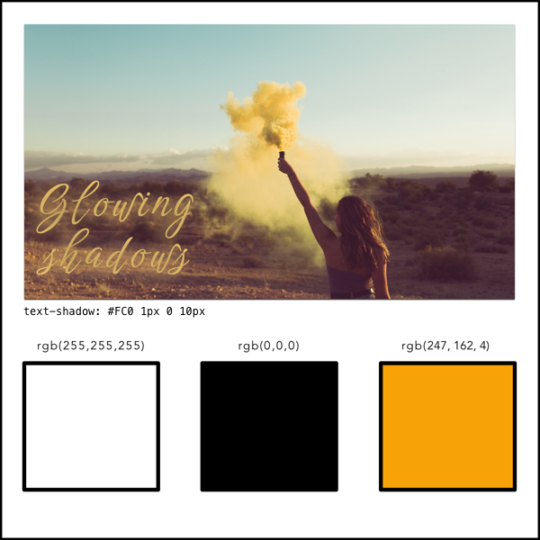

* Typography

    Lato is an open source, sans-serif font. Lato font is the main font used throughout the site with Architects Daughter font used to headers and logo. The font is created to give the letterforms familiar harmony and elegance. The semi-rounded details of the letters give Lato a feeling of warmth, while the strong structure provides stability and seriousness. Lato is used in the body content for the site to appear to be approachable which is the main goal for this website. 
    
    Architects Daughter font incorporates the graphic, squared look of architectural writing, combined with the natural feel of daily handwriting. It is clean but unconventional and gives the site a relaxed vibe. The combination of these two fonts represents both the webshop/business side aswell as the relaxed boho approach. 

    

* Imagery

    Images and the choices of the images is an important component of this site. The hero image on the landing page gives the site a dramatic appearance and sets the tone for the boho inspired page. I use lot of space around images and content to get the visitor an uncluttered and comfortable browsing experience on all device sizes. The product images for the e-commerce part of the site is chosen to be more artistic than detailed to fit the boho-tone. The appearance is aiming to be appealing to the target audience. 

* Icons

    All icons used are taken from Font Awsome. The use of icons in web design is a proven method to modernize a website and help direct user flow. Adding icons to the site's content helps a user better process the information and provides a visual focus point that grounds a user to a specific section. I used an arrow icon recurring throughout the site, to improve visual interest and grab the user's attention.  

 

## Wireframes 

* [Mobile](https://github.com/jennymalmoe/MSP4/tree/main/wireframes/mobile) 
* [Tablet](https://github.com/jennymalmoe/MSP4/tree/main/wireframes/tablet)
* [Desktop](https://github.com/jennymalmoe/MSP4/tree/main/wireframes/desktop)

## Site Map

Initial site map shown below:

 

**Post wireframes design changes:**
While the project relied on these wireframes, there are some differences between the wireframes and the final product; 

* No spinner icon while Stripe payment is processing.
* An "About Us" page with a contact form was added. 

**Responsive Screenshot on different devices**

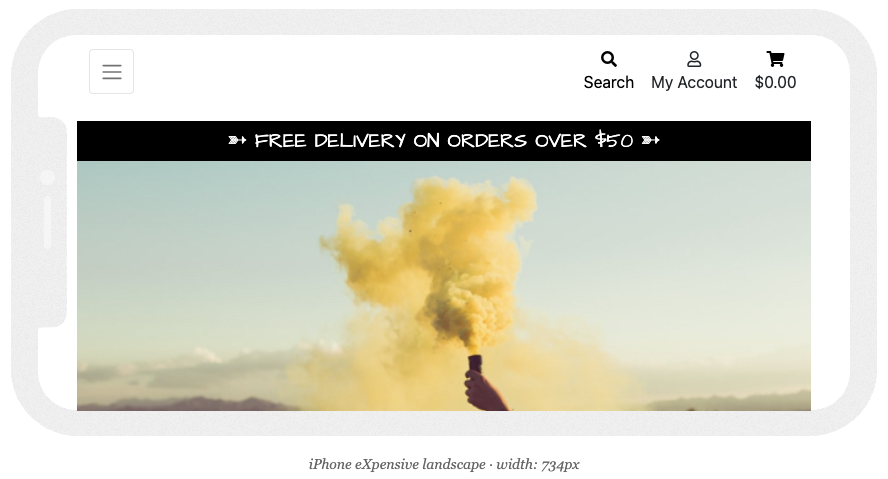
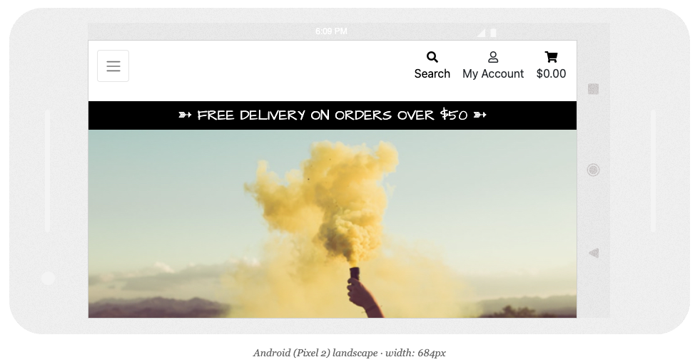

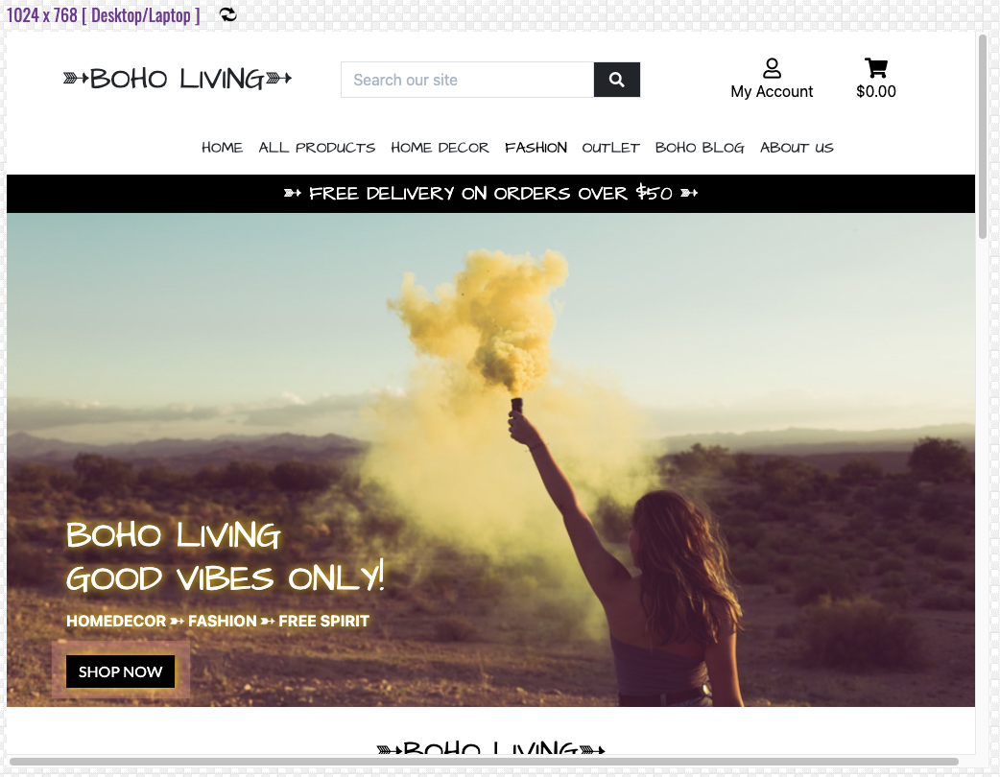

 

# Features

## Existing Features 

 

Every page of the website features a consistently responsive and intuitive layout and navigational system.

**General features shown at all pages**
* Fixed navigation bar, including logo or home link that links to home page from all pages, search function, my account ("Sign in", "Sign up", "Product management" and "My profile") and bag total icon and eventual amount.  
* Main navigations links in navigation bar shown as a collapsible navbar (hamburger button) shown at tablets and mobile devices.  
* Footer with short presentaion/bait of the blog, a contact button, nav links, links to social media and copyright info. 
* Delivery banner which indicates free delivery on orders over 50$. 
* Back to top button.
* An account with Super User privileges has been created for testing purposes.
* Responsive site on all devices.

**Home**

The home page features three sections, apart from the header and the footer.

* Hero image with CTA (clicking "Shop now" redirects visitor immediately to the product page) and text.
* Intro text about B.L.
* Carousel with inspiring images of products that links to the actual product category.

**Products**

* Product section presents the category visiting at the time at the top of the page (except when choosing "All products"), and the number of items in this particular category and a by select box below. The products are presented in rows (1-4 rows depending on the device) including product name, price, category and rating.
* Product details displays a detailed view of the product with product name, price, category, rating, description, quantity input field and "Keep shopping" and "Add to bag" button all in one column.  

**Home Decor**

* Home Decor section consists of following categories: "New in", "Furnitures", "Decor", "Textiles", "Incense" and "All home decor", which are presented at the top of the page. 

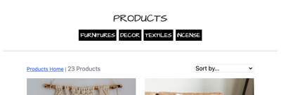

**Fashion**

* Fashion section consists of following categories: "New in", "Clothes", Accessories", "Bags" and "All fashion", which are presented at the top of the page. 

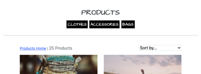

**Outlet**

* Outlet page contains products with discounted prices, category is presented at the top of the page. 

**Boho Blog**

* Boho Blog page contains inspiring blog posts added by admin or users. It has an intro text about general boho style at the top and two "Create your blog post" buttons, one above the blog posts and one below. Each blog post has a title, author, date, text, "Read more" button and an image. All blog posts are presented in one column. 

**About us**

* About us page contains short background information about B.L at the top and a contact form below. When filling out the form and submit it, an alert shows in the middle of the screen; "Your message has been sent". User also gets an email that confirms that B.L has received the question.

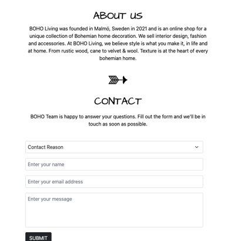

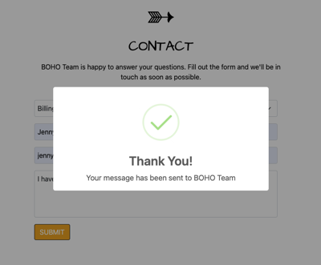

**My account**

If not signed in:
* Sign up - allows visitor to sign up. If user already has an account there is also a link to log in instead. When signing up a toast whit success message is shown and a confirmation mail is sent.
* Sign in - allows registered users to log in. When signed in, a welcome toast is shown.

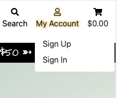

If signed in:
* My Profile - if saved, users delivery information is shown, with the possibility to update the information. If user has an order history it is shown here. 
* Logout - a confirmation text "Are you sure you want to signout?" and a sign out button. 

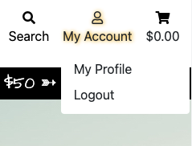

If signed in as a superuser:
* Product management - when signed in a product management link is shown in "My Account" dropdown where you can add products by choosing category, SKU, name, description, size, prize, rating, image url.

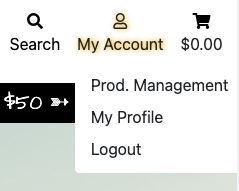

**Shopping cart**

* When shopping cart is empty, an "Your bag is empty" message displays at a new page, along with a "Let's shop" button below the message. 

* When shopping cart has items, the shopping bag page is displayed along with the products that are added in bag (including product info, prize, quantity, subtotal, product image, product name, size, update, remove, bag total, delivery cost, grand total, message of how much more to spend to get free delivery, "Keep shopping" and "Checkout" button). "Keep shopping" button links to "All products" page. "Checkout" button links to checkout page. 

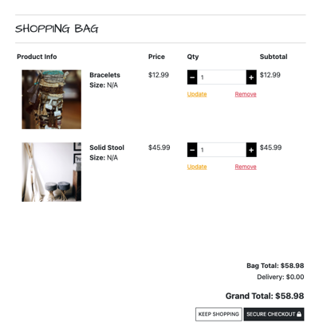

**Checkout**

* Checkout page contains of two sections, one column with a form including details, delivery and payment details, "Adjust bag" and "Complete order" button. The other section (second column) consists of an order summary. When completing the order, a success toast is shown in upper right corner and user get redirected to "Thank you for choosing BOHO Living" page that includes order information, a "Check out the latest deals" that links to "New in products". A confirmation mail is sent to user. 

**Toasts**

Four different kind of toasts appears when a certain action has been triggered by user to get feedback on the action (For example adding something in bag, logging in etc.); "Success", "Info", "Warning", "Error".

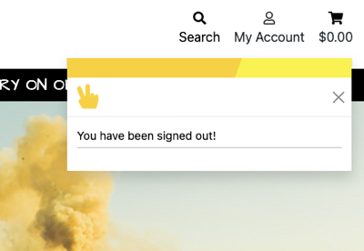

**Django-allauth**

* A Python package used to the sign up, login, logout, password change features. 

**Emailjs**
* Used to send confirmation mail after user filled out the contact form and success message when submitting the form.  

 

## Features left to implement
* Comments and ability to share blog posts to social media (potential to convert more readers into paying customers). 
* Elaborate the SKU numbers, to make even more logical to Administrator.
* Social media login.
* More categories. 
* Function to make users giving rating. To day set by sales numbers.  
* Email notification functionality for users to be alerted when a new product or service is added.
* User profile picture functionality, allowing users to add profile pictures. Nice feature if posting blog posts. 
* Allowing users to comment the products.
* Easier to get contacted by business partners regarding any collaboration, business deals and sponsorship.
* Get more contact information about the registered users to be able to reach out (newsletters, offers etc).
* Expand blog section to have different categories, ideas, what products is on sale, new in etc.  
* Customize site based on Analytics statistic, who are the visitors/users. What pages and products are popular and not and adjust sortiment/site to that to increases the ROI (return on investment). 
 

## Issues and Bugs

* **Known bug:** On some iOS devices, this happens; Nothing happens when clicking "Register" or "Login" (if I am not signed in) after added item(s) in the bag (=toast). After signed in, nothing happens when clicking my profile or log out either. I need to refresh the page to be able to. Then it works as expected.   

* Some responsive design didn't work as expected, since the project use Bootstrap 5.1 I had to add "-bs-" in "data-toggle", "data-target", "data-autohide". 

* Toast messages didn't show as expected needed to change the JavaScript from: $('toast').toast('show') to $('.toast').show() to make the toast show as expected.

* When register new user at "My Account" an SMTPAuthenticationError at /accounts/signup/ occurred and text showed; "Already have an account? Then please sign in". I had "DEVELOPMENT" in my Gitpod settings, but scope was set for my old milestone project, not to this one (or */* (to access all)). It was trying to use the gmail smtp from Gitpod but gmail was expecting the Heroku app to access it, so it wasn't authenticated and thats why it didn't work. So after changed it to access all (*/*) it worked as expected. 

* No confirmation mail (to the terminal) was sent after making a "payment", just an 404 error in the terminal. I edited webhook endpoint in Stripe and then got an 200 error in terminal and a "payment_intent.succeeded" in Stripe, but no confirmation mail still. The problem was that the webhook itself wasn't set up quite right, I needed to add "8000-" in the beginning of my webhook and added checkout/wh/ in the end. I also had STRIPE_WH_KEY instead of STRIPE_WH_SECRET in Gitpod Environment Variables. When chaged those two things confirmation mail worked as expected. 

## Security features

If user accendentally or intentionally closes the browser window after the payment is confirmed but before the form is submitted, there would be a payment in Stripe, but no order in the database. To prevent this situation; Each time an event occurs on Stripe (such as a payment intent being created) a payment being completed on Stripe a webhook is sent out that we can listen for. Webhooks are like the signals django sends each time a model is saved or deleted. Except that they are sent securely from Stripe to a url we specify. *(from Boutique Ado project, Stripe, part 10)*

# Database Design

This database uses a SQL database through PostgreSQL. Initially the databases were built in JSON files, [link here!](products/fixtures)

## Categories Database

## Products Database

## Information Architecture
Heroku PostgreSQL is used to host the backend database for this site. B.L contains of these Django apps:

* About
* Bag
* Blog
* Checkout
* Home
* Products
* Profiles

## Database schema

## Database Model

During development the project used SQLite. The deployed app is using Heroku Postgres.

Full list of data models used: 

### Profile App

 

**Profile model**

|Name             |Database Key            |Field Type         | Validation Requirements                     |
|-----------------|------------------------|-------------------|---------------------------------------------|
|User             |user                    |OneToOneField(User)|on_delete=models.CASCADE                     |
|Phone Number     |default_phone_number    |CharField          |max_length=20, null=True, blank=True         |
|Street Address 1 |default_street_address1 |CharField          |max_length=80, null=True, blank=True         |
|Street Address 2 |default_street_address2 |CharField          |max_length=80, null=True, blank=True         |
|Town or City     |default_town_or_city    |CharField          |max_length=40, null=True, blank=True         |
|Postcode         |default_postcode        |CharField          |max_length=20, null=True, blank=True         |
|Country          |default_country         |CountryField       |blank_label='Country', null=True, blank=True |

 

### Products App

 

**Category Model**

| Name             | Database Key            | Field Type              | Validation Requirements                               |
|------------------|-------------------------|-------------------------|-------------------------------------------------------|
| Name             | name                    | CharField               | max_length=250                                        |
| Friendly Name    | friendly_name           | CharField               | max_length=250, null=True, blank=True                 |

 

**Product Model**

| Name             | Database Key            | Field Type              | Validation Requirements                               |
|------------------|-------------------------|-------------------------|-------------------------------------------------------|
| Category         | category                | ForeignKey              | null=True, blank=True, on_delete=models.SET_NULL      |
| Sku              | sku                     | CharField               | max_length=250, null=True, blank=True                 |
| Name             | name                    | CharField               | max_length=250                                        |    
| Description      | description             | TextField               | None                                                  |
| Has sizes        | has_size                | BooleanField            | default=False, null=True, blank=True                  |        
| Price            | price                   | DecimalField            | max_digits=6, decimal_places=2                        |
| Rating           | rating                  | DecimalField            | max_digits=6, decimal_places=2, null=True, blank=True |    
| On Sale          | on_sale                 | BooleanField            | default=False, blank=True                             |
| Discount Percent | discount_percent        | DecimalField            | max_digits=2, decimal_places=0, blank=True, null=True |
| Image Url        | image_url               | URLField                | max_length=1025, null=True, blank=True                |
| Image            | image                   | ImageField              | null=True, blank=True                                 |

 

### Checkout App

 

**Order Model**

| Name                     | Database Key    | Field Type                 | Validation                                                   |
| ------------------------ | --------------- | ---------------------------| -------------------------------------------------------------|
| Order Number             | order_number    | CharField                  | max_length=32, null=False, editable=False                    |
| User Profile             | user_profile    | ForeignKey(UserProfile)    | on_delete=models.SET_NULL, blank=True,null=True, related_name='orders'  |
| Full Name                | full_name       | CharField                  | max_length=50, null=False, blank=False                       |
| Email.                   | email           | EmailField                 | max_length=254, null=False, blank=False                      |
| Phone Number             | phone_number    | CharField                  | max_length=20, null=False, blank=False                       |
| Country                  | country         | CountryField               | blank_label='Country *', null=False, blank=False             |
| Postcode                 | postcode        | CharField                  | max_length=20, null=True, blank=True                         |
| Town or City             | town_or_city    | CharField                  | max_length=40, null=False, blank=False                       |
| Street Address 1         | street_address1 | CharField                  | max_length=80, null=False, blank=False                       |
| Street Address 2         | street_address2 | CharField                  | max_length=80, null=True, blank=True                         |
| Date                     | date            | DateTimeField              | auto_now_add=True                                            |
| Delivery Cost            | delivery_cost   | DecimalField               | max_digits=6, decimal_places=2, null=False, default=0        |
| Order Total              | order_total     | DecimalField               | max_digits=10, decimal_places=2, null=False, default=0       |
| Grand Total              | grand_total     | DecimalField               | max_digits=10, decimal_places=2, null=False, default=0       |
| Original Bag             | original_bag    | TextField                  | null=False, blank=False, default=''                          |
| Stripe Payment Intent ID | stripe_pid      | CharField                  | max_length=254, null=False, blank=False, default=''          |

 

**Order Line Item Model**

| Name            | Database Key   | Field Type          | Validation                                                                   |
| --------------- | -------------- | --------------------| -----------------------------------------------------------------------------|
| Order           | order          | ForeignKey(Order)   | null=False, blank=False, on_delete=models.CASCADE, related_name='lineitems'  |
| Product         | product        | ForeignKey(Product) | null=False, blank=False, on_delete=models.CASCADE                            |
| Product Size    | product_size   | CharField           | max_length=2, null=True, blank=True                                          |
| Quantity        | quantity       | IntegerField        | null=False, blank=False, default=0                                           |
| Line Item Total | lineitem_total | DecimalField        | max_digits=6, decimal_places=2, null=False, blank=False, editable=False      |

 

## Blog App

 

### Blog Model

| Name            | Database Key   | Field Type          | Validation                                                                   |
| --------------- | -------------- | --------------------| -----------------------------------------------------------------------------|
| Title           | title          | CharField           | max_length=150, null=False, blank=False                                      | 
| Body            | body           | TextField           | max_length=5000, null=False, blank=False                                     |
| Image           | image          | ImageField          | upload_to='blogimages', null=True, blank=True                                |
| Date Published  | date_published | DateTimeField       | auto_now_add=True, verbose_name="date published"                             |
| Date Updated    | date_updated   | DateTimeField       | auto_now=True, verbose_name="date updated"                                   |
| Author          | author         | ForeignKey          | User, on_delete=models.CASCADE                                               | 
| Slug            | slug           | SlugField           | max_length=150, blank=True, unique=True                                      |
| | |

 

# Technologies Used

 

## IDE - Integrated Development Environment
* [GitHub](https://github.com/) - Used to store the projects code after being pushed from Git. 

## Languages
* [HTML](https://developer.mozilla.org/en-US/docs/Web/HTML) - Used to create the site structure.
* [CSS](https://developer.mozilla.org/en-US/docs/Web/CSS) - Used to create the styling throughout the site.
* [JavaScript](https://developer.mozilla.org/en-US/docs/Web/JavaScript) - Used for the sidenav, back-to-top button, image preview.
* [Python](https://www.python.org/) - Used to write the logic that operates the site.

## Database 
* [SQLite](https://www.sqlite.org/index.html) - Database used during development.
* [Heroku Postgres](https://www.heroku.com/home) - Database used for production/deployed app. 

## Storage 
* [Amazon AWS S3](https://aws.amazon.com/?aws-products-compute.sort-by=item.additionalFields.productNameLowercase&aws-products-compute.sort-order=asc&aws-products-iot.sort-by=item.additionalFields.productNameLowercase&aws-products-iot.sort-order=asc&aws-products-security.sort-by=item.additionalFields.productNameLowercase&aws-products-security.sort-order=asc) - The Amazon Web Service s3 Bucket was used to store media and static files.

## Payment 
* [Stripe](https://stripe.com/) - Payment platform. 

## Frameworks 
* [Bootstrap](https://getbootstrap.com/) - Bootstrap 5.1 used to design and build responsive, mobile-first sites.
* [Django](https://www.djangoproject.com/) - Web development framework.

## Libraries, Tools, Editors 

* [Am I Responsive](http://ami.responsivedesign.is/) - Used to validate the responsiveness. 
* [Balsamiq](https://balsamiq.com/) - Used to create wireframes.
* [Bulma](https://bulma.io/) - Used for icon class.
* [Chrome DevTools](https://developer.chrome.com/docs/devtools/)  - Used Lighthouse to check sites performance and dev tool to check responsiveness.
* [Dj-database-url](https://pypi.org/project/dj-database-url/) - A utility to help you load your database into your dictionary from the DATABASE_URL environment variable.
* [Django Allauth](https://django-allauth.readthedocs.io/en/latest/) - Used to create the user sign-in function for the site.
* [Django Countries](https://pypi.org/project/django-countries/) - Used for the country select field in the order form.
* [Django Crispy Forms](https://django-crispy-forms.readthedocs.io/en/latest/) - Used to utilise the Bootstrap form classes.
* [drawSQL](https://drawsql.app/) - Used to create database diagram.
* [Font-Awesome](https://fontawesome.com/) - Used for icons.
* [Git](https://git-scm.com/) - Used for version control to commit to Git and push to Heroku.
* [Gitpod](https://gitpod.io/) - Open-source application for ready-to-code developer environments in browser.
* [Google fonts](https://fonts.google.com/) - Used to import fonts.
* [Gunicorn](https://gunicorn.org/) - Used for deploying the project to Heroku.
* [Imgur](https://imgur.com/) - Used to create url:s for images.
* [Jinja](https://jinja.palletsprojects.com/en/2.10.x/) - Jinja templating language was used to simplify and display backend data in html.
* [JSHint](https://jshint.com/) - JavaScript code quality tool, used to detect errors.
* [Unsplash](https://unsplash.com/) - Images used throughout the site.
* [PEP8](https://www.python.org/dev/peps/pep-0008/) - Used to improve the readability and consistency of Python code.
* [PEP8online](http://pep8online.com/) - Used to check code for PEP8 requirements.
* [Pillow](https://pillow.readthedocs.io/en/stable/) - Python Imaging Library.
* [Pixelmator](https://www.pixelmator.com/mac/) - Used to resize images, creating logo and tab icon.
* [Responsinator](https://www.responsinator.com/) - Used for the responsive screenshoots on different device resolutions. 
* [Responsive Test Tool](http://responsivetesttool.com/) - Used for the responsive screenshoots on different device resolutions. 
* [Postimages](https://postimages.org/) - Used to create url for images. 
* [SweetAlert2](https://sweetalert2.github.io/) - Used to customise the contact form success message
* [TechSini](https://techsini.com/) - Mockup generator used for preview of the website.
* [Visual Studio Code](https://code.visualstudio.com/) - IDE used for code editing.
* [W3C Validator](https://validator.w3.org/) - Used to test HTML code.
* [W3C Validator CSS](https://validator.w3.org/) - Used to test CSS code.

## Packages/Dependencies

| Name | Purpose |
|------|---------|
| asgiref | Allows web apps and servers to communicate |
| Boto3 | AWS Management |
| Botocore | AWS Management |
| crispy-bootstrap5 | Bootstrap5 template pack for django-crispy-forms |
| dj-database-url | Database Configuration |
| Django | Framework |
| django-allauth | Authentication |
| django-countries | Country Form Field |
| django-crispy-forms | Front End Form Rendering |
| django-storages | Custom Storage Backends |
| gunicorn | WSGI HTTP Server |
| jmespath | Data driven testcases |
| oauthlib | Framework |
| Pillow | Images |
| psycopg2-binary | PostgreSQL DB Adaptor |
| python3-openid | Python packages |
| pytz | Library |
| requests-oauthlib | Authentication support for Requests |
| s3transfer | Python library for managing Amazon S3 transfers |
| sqlparse | Non-validating SQL parser for Python |
| Stripe | Secure Payment Services |
| | |

 

# Testing
Testing section is located here [testing.md file](documentation_testing/testing.md)

Validating code
* HTML code is validated through [W3C Validator](https://validator.w3.org/)

* CSS code is validated through [W3C Validator CSS](https://validator.w3.org/)

* JavaScript code is validated through [JSHint](https://jshint.com/)

* Python code is validated through [PEP8](https://www.python.org/dev/peps/pep-0008/)

 

# Deployment

 

Requirements to deploy:

* An IDE (Gitpod)
* Python3 (In order to to run the application and use Flask)
* PIP3 (To install all application imports, such as Flask and OS)
* A template folder (To link app routes)
* A database (MongoDB Atlas)

 

## MongoDB Configuration
1. Login to your [MongoDB](https://www.mongodb.com/) Account.
2. From Clusters tab, click on Connect.
3. Select Connect to your application.
4. Select Python as Driver and choose Version 3.6 or later
5. Create a new env python file in your project, paste and save the connection link and variables.

6. Create an instance of PyMongo

 

## GitHub Pages
1. Log into [GitHub](https://github.com/)
2. From the list of repositories, select the repository wanting to deploy.
3. From the menu items near the top of bthe page, select "Settings"
4. Scroll down to the GitHub Pages section.
5. Under "Source" click the drop-down menu labbelled "None" and select "Master Branch"
6. On selecting "Master Branch" the page is automatically refreshed, website is now deplyed. 
7. Scroll back down to the GitHub Pages section to retrieve the link to the deployed site. 

 

## Forking the GitHub Repository
Making a copy of the original repository on our GitHub account to view or to make changes without affecting the original repository;
1. Log into [GitHub](https://github.com/) and locate the repository.
2. At the top of the Repository, just above the "Settings" button on the menu, locate the "Fork" button.
3. You should now have a copy of the original repository in your GitHub account.

 

## Making a Local Clone
1. Install the Gitpod Browser Extentions for Chrome.
2. After installation, restart the browser. 
3. Log in to [Gitpod](https://www.gitpod.io/) with your gitpod account.
4. Navigate to the Project GitHub repository.
5. Click the green "Gitpod" button in the top right corner of the repository.
6. This triggers a new gitpod workspace to be created from the code in GitHub where you can work locally.

## To work on the project code within a local IDE 
1. Log in to [GitHub](https://github.com/) and locate the GitHub Repository.
2. Under the repository name, click "Clone or download".
3. In the clone with HTTPs section, copy the clone URL for the repository.
4. Open the terminal in your local IDE.
5. Change the current working directory to the location where you want the cloned directory to be made.
6. Type **git clone**, and then paste the URL you copied in Step 3.
7. Press Enter. Your local clone will be created.

 

## Heroku Deployment
1. Before deploying your project create a requirements.txt file by running the following command in the CLI;

    

2. Create a Procfile file by running the following command in the CLI;

    

3. git add and git commit the new requirements and Procfile and then git push the project to GitHub.
3. Log in to [Heroku](https://dashboard.heroku.com/apps).
4. Select "New" on your dashboard and then select "Create new app".
5. Choose a name for your application, select your region, and then click "Create app".
6. From the app dashboard, navigate to "Deploy" tab.
7. From Deployment method select "Github" and confirm the linking of the Heroku app by clicking "Search" then select your repository name.
8. Once you select your repository, click on "Connect".
9. After you connected to your repository, click on "Settings" tab on your app dashboard, and click on "Reveal Config Vars" and add your configuration variables to Heroku.
10. Navigate to "Deploy" tab, and from Manual deploy choose your master branch, and click "Deploy Branch".
11. After you deployed your branch "Enable Automatic Deploys".
12. Site is successfully deployed, any further changes will automatically be updated everytime they are commited and pushed on Github.

 

# Credits
* Code Institute tutor support.
* Fellow students on Slack for a helping hand when I've got stuck.
* Code Institute for inspiration from the Boutique Ado project.
* https://codingwithmitch.com/ for code and inspiration to my blog section. 

 

lägga in requiremets in handbook for msp4 in user stories

AWS Policy Generator
The AWS Policy Generator is a tool that enables you to create policies that control access to Amazon Web Services (AWS) products and resources.

https://django-allauth.readthedocs.io/en/latest/installation.html

google applösenord

So a word of warning about your webhooks still. This all works fine for your local endpoint, but if you're going to use the heroku one it will need a different WH_SECRET_KEY in your Heroku cvars. You can find this by Reveal the signing secret you find for the heroku endpoint in Stripe website. So both local and deployed site have the same STRIPE_PUBLIC_KEY and STRIPE_SECRET_KEY but they will have different STRIPE_WH_SECRET.

 

 

 

